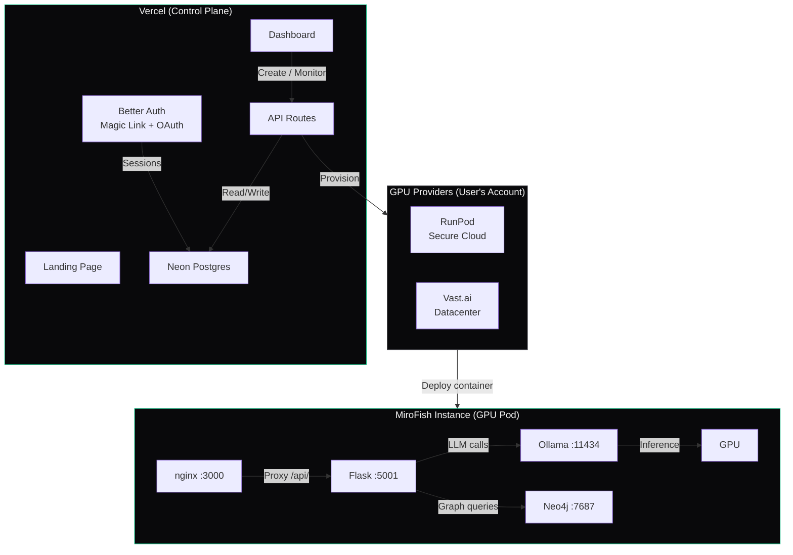

# MiroFish Cloud

Built on [MiroFish-Offline](https://github.com/nikmcfly/MiroFish-Offline) by [@nikmcfly](https://github.com/nikmcfly) — a fully local fork of [MiroFish](https://github.com/666ghj/MiroFish), the multi-agent swarm intelligence engine that simulates public opinion, market sentiment, and social dynamics. Powered by the [OASIS](https://github.com/camel-ai/oasis) social simulation framework by [CAMEL-AI](https://github.com/camel-ai).

MiroFish Cloud is a hosted control plane that deploys dedicated GPU instances running MiroFish with Ollama. Upload a document, generate hundreds of AI agents with unique personalities, and watch them simulate the public reaction on social media — entirely on your own infrastructure. Zero external API calls, your data never leaves your server.

**Live:** https://mirofish-cloud.vercel.app

### What lives where

| Component | Location | User data? |
|-----------|----------|------------|
| Landing page, auth, dashboard | Vercel | Email only |
| Instance registry | Neon Postgres | URLs + status only |
| Provider credentials | Neon Postgres | AES-256-GCM encrypted |
| MiroFish app + simulation data | User's GPU pod | **All user data stays here** |
| Neo4j knowledge graph | User's GPU pod | **Never leaves the pod** |
| Ollama LLM | User's GPU pod | **Zero external calls** |

## Tech Stack

| Layer | Technology |
|-------|-----------|
| Framework | Next.js 16 (App Router) |
| Database | Neon Postgres + Drizzle ORM |
| Auth | Better Auth (magic link + Google + GitHub) |
| Email | Resend |
| Styling | Tailwind CSS 4.2 |
| Icons | Lucide React |
| GPU Providers | RunPod, Vast.ai |
| Container | Python 3.11 + Neo4j 2026.02 + Ollama + nginx |

## Local Development

### Prerequisites

- Node.js 24+
- A [Neon](https://neon.tech) database (free tier)
- A [Resend](https://resend.com) API key (free tier, for magic link emails)

### Setup

```bash
# Clone
git clone https://github.com/radishbuild/mirofish-cloud.git
cd mirofish-cloud

# Install dependencies
npm ci

# Create env file
cp .env.local.example .env.local
```

Edit `.env.local`:

```bash
# Required
DATABASE_URL=postgresql://...@...neon.tech/neondb?sslmode=require
BETTER_AUTH_SECRET=<run: openssl rand -hex 32>
BETTER_AUTH_URL=http://localhost:3000
NEXT_PUBLIC_APP_URL=http://localhost:3000
ENCRYPTION_KEY=<run: openssl rand -hex 32>
RESEND_API_KEY=re_...

# Optional (for OAuth login)
GITHUB_CLIENT_ID=...
GITHUB_CLIENT_SECRET=...
GOOGLE_CLIENT_ID=...
GOOGLE_CLIENT_SECRET=...

# Docker image for GPU instances
DOCKER_IMAGE_GPU=ghcr.io/radishbuild/mirofish-gpu:latest
```

### Push database schema

```bash
npx drizzle-kit push
```

### Run

```bash
npm run dev
```

Open http://localhost:3000

### Available scripts

```bash
npm run dev          # Development server
npm run build        # Production build
npm run lint         # ESLint
npm run format       # Prettier (auto-fix)
npm run check        # TypeScript + ESLint + Prettier
```

## How It Works

### User flow

1. **Sign in** via magic link or OAuth (Google/GitHub)
2. **Connect** a GPU provider (RunPod or Vast.ai) with your own API key
3. **Select a GPU** from live availability (fetched from provider in real-time)
4. **Deploy** — a dedicated GPU pod is provisioned with MiroFish + Neo4j + Ollama
5. **Open simulation** — once the pod is ready, access MiroFish directly on your instance
6. **Stop/Destroy** when done — you control the lifecycle, no auto-billing

### Instance lifecycle

```
Create → Provisioning → Running → Stop/Destroy
                ↑                      |
                └──────── Start ───────┘
```

- **Provisioning**: Pod created, container starting, models pulling (5-8 min)
- **Running**: Health check passed, "Open simulation" button appears
- **Stopped**: Pod halted, no billing, data preserved
- **Destroyed**: Pod deleted, all data gone

### Provider credentials

- Stored encrypted (AES-256-GCM) in Neon Postgres
- Never returned to the frontend after saving
- Used server-side only to make provider API calls
- Deleted permanently on disconnect

## GPU Container Image

The MiroFish GPU image (`Dockerfile.gpu`) runs everything in one container:

| Service | Port | Purpose |
|---------|------|---------|
| nginx | 3000 | Serves Vue frontend, proxies /api to Flask |
| Flask | 5001 | MiroFish backend |
| Neo4j | 7687 | Knowledge graph database |
| Ollama | 11434 | Local LLM inference on GPU |

### Build the image

```bash
docker build -f Dockerfile.gpu -t ghcr.io/radishbuild/mirofish-gpu:latest .
docker push ghcr.io/radishbuild/mirofish-gpu:latest
```

### Test locally (no GPU needed for basic testing)

```bash
docker run -p 3000:3000 \
  -e LLM_API_KEY=ollama \
  -e LLM_BASE_URL=http://localhost:11434/v1 \
  -e LLM_MODEL_NAME=qwen2.5:7b \
  -e OLLAMA_MODEL=qwen2.5:7b \
  -e NEO4J_PASSWORD=mirofish \
  ghcr.io/radishbuild/mirofish-gpu:latest
```

## Architecture



## Project Structure

```
├── src/
│   ├── app/
│   │   ├── (marketing)/page.tsx          # Landing page
│   │   ├── (auth)/login/page.tsx         # Magic link + OAuth login
│   │   ├── (dashboard)/
│   │   │   ├── dashboard/page.tsx        # Instance list
│   │   │   ├── dashboard/new/page.tsx    # Create instance
│   │   │   ├── dashboard/[id]/page.tsx   # Instance detail
│   │   │   └── dashboard/settings/       # Provider credentials
│   │   └── api/
│   │       ├── auth/[...all]/            # Better Auth handler
│   │       ├── credentials/              # Provider key management
│   │       ├── instances/                # Instance CRUD + lifecycle
│   │       ├── providers/[provider]/     # GPU type listing
│   │       └── cron/poll-status/         # Background status polling
│   ├── components/                       # Shared UI components
│   └── lib/
│       ├── auth.ts                       # Better Auth config
│       ├── crypto.ts                     # AES-256-GCM encryption
│       ├── db/schema.ts                  # Drizzle schema
│       └── providers/                    # RunPod + Vast.ai integrations
├── Dockerfile.gpu                        # MiroFish container image
├── nginx.gpu.conf                        # nginx config for container
├── start-gpu.sh                          # Container startup script
└── vercel.json                           # Vercel config
```

## License
 
AGPL-3.0 — same license as [MiroFish-Offline](https://github.com/nikmcfly/MiroFish-Offline). All modifications must remain open source.
